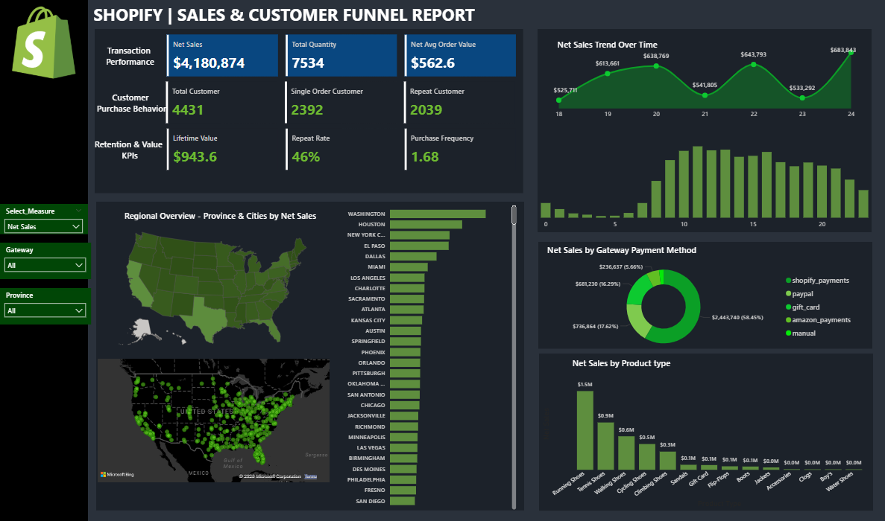

Shopify Sales & Customer Funnel Report | Power BI
Project Overview

This project presents a Shopify Sales & Customer Funnel Dashboard built using Power BI to analyze sales performance, customer purchasing behavior, and product performance across regions.

The dashboard helps stakeholders quickly understand revenue trends, customer retention, payment gateway performance, and product demand through interactive visualizations.

It is designed to support data-driven decision making for e-commerce businesses by transforming raw Shopify transaction data into meaningful business insights.

Dashboard Preview 

Key Business Questions Answered

This dashboard helps answer important business questions such as:

What is the total sales performance of the store?

How many customers are new vs repeat buyers?

What is the average order value?

Which payment gateways generate the most revenue?

Which products drive the highest sales?

How do sales trends change over time?

Which regions or cities generate the most sales?

Key Metrics Tracked
Transaction Performance

Net Sales

Total Quantity Sold

Net Average Order Value

Customer Purchase Behavior

Total Customers

Single Order Customers

Repeat Customers

Retention & Value KPIs

Customer Lifetime Value

Repeat Purchase Rate

Purchase Frequency

Dashboard Features
Sales Trend Analysis

Track sales performance over time to identify growth patterns and demand fluctuations.

Regional Sales Analysis

Interactive maps showing sales distribution across states and cities.

Payment Gateway Insights

Breakdown of revenue generated through payment methods such as:

Shopify Payments

PayPal

Gift Card

Amazon Payments

Manual Payment

Product Performance

Identify top-selling products and categories contributing most to revenue.

Customer Retention Metrics

Understand how often customers return and their lifetime value.

Interactive Filters

Users can dynamically filter the dashboard by:

Measure (Sales metrics)

Payment Gateway

Province / Region

Tools & Technologies Used

Power BI – Data visualization & dashboard development

DAX (Data Analysis Expressions) – KPI calculations and measures

Data Modeling – Structured relationships between tables

Power Query – Data cleaning and transformation

Data Preparation Steps

Imported Shopify transaction dataset into Power BI.

Cleaned and transformed data using Power Query.

Created calculated measures using DAX for KPIs.

Built a data model to connect customers, transactions, and products.

Designed interactive visualizations and slicers.
